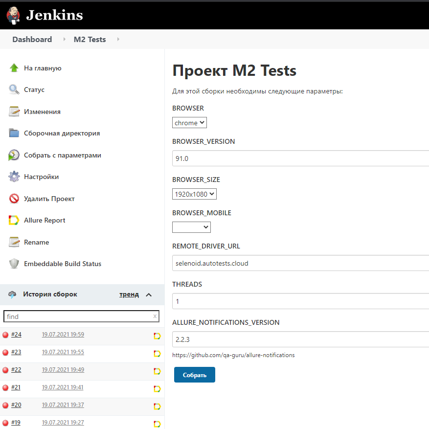
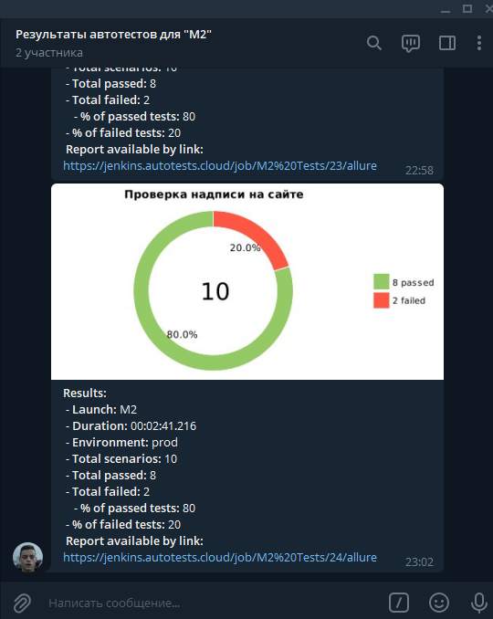

# Автотесты для https://m2.ru/
<a href="https://www.jetbrains.com/idea/">
    
</a>
<a href="https://www.jetbrains.com/idea/">
    
</a>
<a href="https://www.jetbrains.com/idea/">
    
</a>
<a href="https://www.jetbrains.com/idea/">
    
</a>
<a href="https://www.jetbrains.com/idea/">
    
</a>
<a href="https://www.jetbrains.com/idea/">
    
</a>
<a href="https://www.jetbrains.com/idea/">
    
</a>

<a href="https://www.jetbrains.com/idea/">
    
</a>
<a href="https://www.jetbrains.com/idea/">
    
</a>

<a href="https://www.jetbrains.com/idea/">
    
</a>

IntelliJ IDEA, Java 11, Selenide, Selenoid, Gradle, JUnit5, Allure SE, Github, Jenkins, Telegram (reports), 

### Команда для запуска из терминала
Локально должны быть заданы параметры в local.properies, app.properties
```
gradle clean
```
Для запуска в несколько потоков
```
gradle clean -Dthreads=5
```
### Видео о прохождении тестов


### Запуск в Jenkins
Статистика по запускам

Указание параметров для запуска


### Отчёт в Allure Report


### Уведомления в Telegram



