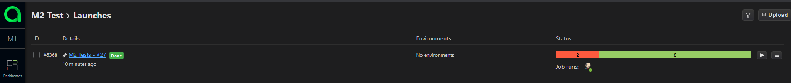
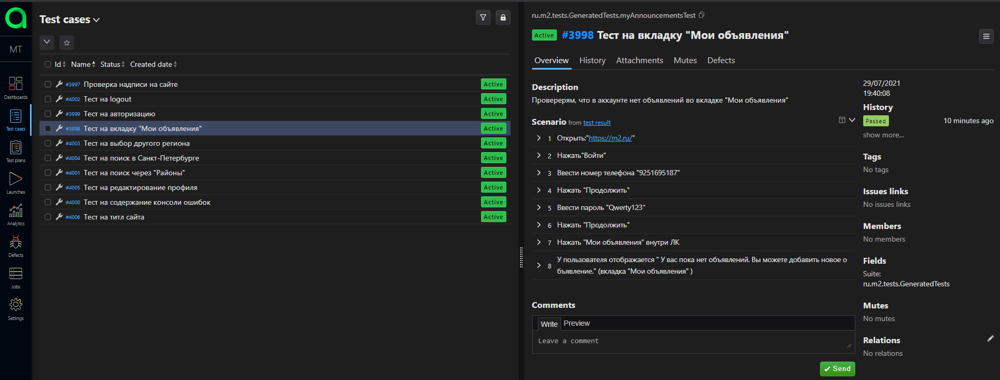

# Автотесты для [**сайта недвижимости M2**](https://m2.ru)
#Используемые технологии и инструменты
<a href="https://www.jetbrains.com/idea/">
    
</a>
<a href="https://www.jetbrains.com/idea/">
    
</a>
<a href="https://www.jetbrains.com/idea/">
    
</a>
<a href="https://www.jetbrains.com/idea/">
    
</a>
<a href="https://www.jetbrains.com/idea/">
    
</a>
<a href="https://www.jetbrains.com/idea/">
    
</a>
<a href="https://www.jetbrains.com/idea/">
    
</a>
<a href="https://www.jetbrains.com/idea/">
    
</a>
<a href="https://www.jetbrains.com/idea/">
    
</a>
<a href="https://www.jetbrains.com/idea/">
    
</a>
<a href="https://www.jetbrains.com/idea/">
    
</a>


IntelliJ IDEA, Java, Selenide, Selenoid, Gradle, JUnit5, Allure SE, Allure TestOps, Github, Jenkins, Telegram (reports)

## Реализованы проверки:
### UI
- [X] - Главная страница имеет надпись :"Отвечаем за каждый квадратный метр"
- [X] - Сайт имеет титл: "Метр квадратный - ипотека и рефинансирование, онлайн сделки с недвижимостью - на сайте m2.ru"
- [X] - Консоль лог не содержит ошибок :rotating_light: как можно будет увидеть из отчета, этот тест провален
- [X] - Выбираем другой город (Санкт-Петербург) как свою локацию
- [X] - Поиск в Санкт-Петербурге
- [X] - Поиск через фильтр "Районы"
- [X] - Авторизация пользователем
- [X] - Проверка наличия объявлений, вкладка "Мои объявления"
- [X] - Редактирование профиля(Изменение фамилии пользователя) :rotating_light: как можно будет увидеть из отчета, этот тест провален
- [X] - Logout с ЛК
    
### Команда для запуска из терминала
Локально должны быть заданы параметры в local.properies, app.properties
```
gradle clean
```
Для запуска в несколько потоков
```
gradle clean -Dthreads=5
```
### Видео прохождения тестов, взятое из среды выполнения (из [**Selenoid**](https://selenoid.autotests.cloud/#/))


### Запуск в [**Jenkins**](https://jenkins.autotests.cloud/job/M2%20Tests/build?delay=0sec)
Удобный и имеющий широкое комьюнити иснтрумент, просто для освоения в виду большого количества учебного материала также удобная настройка pipelines
Статистика по запускам

Указание параметров для запуска


### Отчёт в Allure Report
Инструмент, не нуждающийся в представлении и мгновенно завоеваший популярность против автоматически генерирующихся отчетов с тестовых фреймворков Junit4,5 и TestNG


### Интеграция с TMS TestOps Allure
Удобная интеграция с Test Management System  Allure TestOps (ранее Allure EE), где есть возможность
хранить автотестовые прогоны с автоматическим заведением новых тест-кейсов из автоматизированных, так и создавать тест-кейсы вручную
(такие тест-кейсы также могут быть автоматизированы и при прогоне уже отображаться как авто-тесты, это делается через простой плагин и внесение @Id для автотестов)
- Автоматическая [**загрузка**](https://allure.autotests.cloud/project/279/launches) результата прогона тестов с Jenkins

- [**Визуализация**](https://allure.autotests.cloud/launch/5368) итогов пройденных тестов в Allure TestOps

- Автоматически [**загруженные**](https://allure.autotests.cloud/project/279/test-cases?treeId=0) тест-кейсы

### Уведомления в Telegram
Канал "Результаты автотестов для "M2"" [**для уведомлений**](https://t.me/m2m2m2m2m2m2m2m2m2m2m2m2m22m2)


